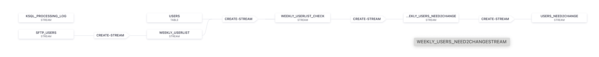
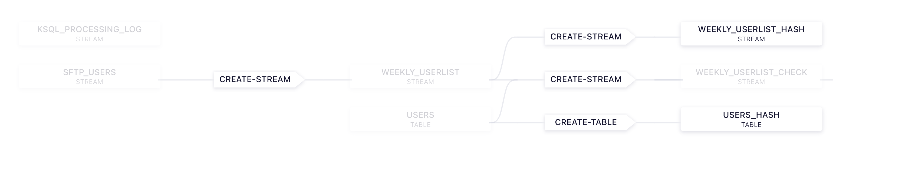

# Sample use case: Diff compare of records in ksql

This simple case show how to find out if a record and therefore a column of a weekley list is changed compared with the system list.
We do the first sample case completely without help with pure SQL.
The seconds case we use the help of a hash, which was implemented with UDF in java.

In the lab we simluate the data coming from a list, which will be load with the Confluent SFTP Connector.

## pre-req

Please do have following components installed on your Macbook.

* Confluent Platform 7.6 installed
* Confluent cli installed
* Java dev installed including JDK 1.8 (in my case) and graddle

Test Java Version: (my UDF jar was compiled with JDK 8), be aware that JDK 1.8 is not supported anymore with CP 8.0.
```bash
java -version
```

## Clone Repository

```bash
git clone https://github.com/ora0600/ksqldb-row-diff-sample.git
cd ksqldb-row-diff-sample
```

## Install Confluent SFTP Connector into local CP installation

SFTP with CSV Schema Sample, please [see](https://docs.confluent.io/kafka-connectors/sftp/current/source-connector/csv_source_connector.html#csv-source-connector-examples)

Create your first data file into `data`dir:
```bash
echo $'{"id":1,"first_name":"Roscoe","last_name":"Brentnall","email":"rbrentnall0@mediafire.com","gender":"Male","ip_address":"202.84.142.254","last_login":"2024-02-12T06:26:23Z","account_balance":1450.68,"country":"CZ","favorite_color":"#4eaefa"}\n{"id":2,"first_name":"Gregoire","last_name":"Fentem","email":"gfentem1@nsw.gov.au","gender":"Male","ip_address":"221.159.106.63","last_login":"2024-03-27T00:29:56Z","account_balance":1392.37,"country":"ID","favorite_color":"#e8f686"}' > "data/json-sftp-source.json"
```

install connector in CP environment. Please be aware that this is a commercial connector and you need after 30 days of evaluation a commercial license from Confluent.
```bash
confluent-hub install confluentinc/kafka-connect-sftp:3.2.1
``` 
Enable SFTP Server on your Mac open System Preferences and select File Sharing (and you need a Mac User to Login. For this  I created a new User). Next, make sure that Remote Login is enabled. 

Change the properties in `jsonsftp.properties` file:
```bash
input.path=/your-path/data
error.path=/your-path/error
finished.path=/your-path/finished
sftp.username=<set your own sftpuser>
sftp.password=<set your own password>
```

## Build a hashing function UDF for ksqlDB, I am runing Java 1.8

You can directly copy the jar from `udf/extensions/udf-0.0.1.jar` into your folder configured in `$CONFLUENT_HOME/etc/ksqldb/ksql-server.properties` see `ksql.extension.dir`.

If you do use a different version of java, you need to build your own jar.
Please do the following for this.
```bash
cd udf
# you need to change the java version here, please check, as I said, I set to JDK 1.8
cat build.gradle
# The build.gradle also contains a copyJar step to copy the jar file to the extensions/ directory
# run the following command to obtain the Gradle wrapper:
gradle wrapper
# Build the jar
./gradlew build
# create extension dir in your CP installation, if not set
mkdir $CONFLUENT_HOME/etc/ksqldb/ext/
echo "ksql.extension.dir=$CONFLUENT_HOME/etc/ksqldb/ext/" >> $CONFLUENT_HOME/etc/ksqldb/ksql-server.properties
# copy Jar to ksqlDB extension dir
cp extensions/udf-0.0.1.jar $CONFLUENT_HOME/etc/ksqldb/ext/
``` 

## Run the first case with pure SQL and without UDF

Start CP 7.6
```bash
confluent local services start
``` 

Create Topic
```bash
kafka-topics --bootstrap-server localhost:9092 --create --partitions 1 --replication-factor 1 --topic sftp-users
```
Open [Control Center](http://localhost:9021/clusters) use URL `http://localhost:9021/clusters`

Install "official User List" via ksqlDB INSERTS, we create it now, because When doing a stream-table join, your table messages must already exists. 
Please use the ksqlDB Editor in Control Center or the ksql cli:
```bash
ksql http://localhost:8088
# Create Orignal USERS
 ksql> CREATE TABLE USERS (
    id bigint primary key,
    first_name varchar,
    last_name varchar,
    email varchar,
    gender varchar,
    ip_address varchar,
    last_login varchar,
    account_balance double,
    country varchar,
    favorite_color varchar
   ) WITH (
     KAFKA_TOPIC = 'users', 
     VALUE_FORMAT = 'JSON',
     PARTITIONS = 1
   );
# Insert the the USERs
ksql> INSERT INTO USERS (id, first_name, last_name, email, gender, ip_address ,last_login , account_balance, country, favorite_color )
     VALUES (1, 'Roscoe', 'Brentnall', 'rbrentnall0@mediafire.com', 'Male', '202.84.142.254', '2018-02-12T06:26:23Z', 1450.68, 'CZ', '#4eaefa');
INSERT INTO USERS (id, first_name, last_name, email, gender, ip_address ,last_login , account_balance, country, favorite_color ) 
      VALUES (2,'Gregoire', 'Fentem', 'gfentem1@nsw.gov.au','Male', '221.159.106.63', '2015-03-27T00:29:56Z', 1392.37, 'ID', '#e8f686');
INSERT INTO USERS (id, first_name, last_name, email, gender, ip_address ,last_login , account_balance, country, favorite_color ) 
      VALUES (3, 'Carsten' , 'Muetzlitz' ,'cmutzlitz@confluent.io', 'Male', '120.181.75.98', '2024-01-30T06:01:15Z', 20000, 'DE', '#f09bc0');
INSERT INTO USERS (id, first_name, last_name, email, gender, ip_address ,last_login , account_balance, country, favorite_color ) 
      VALUES (4, 'Evi', 'Scheider', 'evi@confluent.io', 'Female', '153.239.187.49', '2024-01-31T12:27:12Z', 25000, 'DE', '#73893a');
INSERT INTO USERS (id, first_name, last_name, email, gender, ip_address ,last_login , account_balance, country, favorite_color ) 
      VALUES (5, 'Suvad' , 'Sahovic' ,'suvad@confluent.io', 'Male', '120.181.75.48', '2024-02-15T06:01:15Z', 40000, 'DE', '#f09bc0');
ksql> select * from USERS emit changes;      
ksql> exit;
``` 

Start Connector, make sure you are in the correct folder and that Remote Login is enabled.
```bash
# Check if you are in the main folder: ksqldb-row-diff-sample
pwd
# Start connector
confluent local services connect connector load SchemaLessJsonSftp --config jsonsftp.properties
# Status Connector
confluent local services connect connector status SchemaLessJsonSftp
# Consume from both topics
# 2 rows
kafka-console-consumer --topic sftp-users --from-beginning --bootstrap-server localhost:9092 
kafka-console-consumer --topic users --from-beginning --bootstrap-server localhost:9092 
```

Create Stream on sftp_users
```bash
ksql http://localhost:8088
ksql > set 'auto.offset.reset'='earliest';
ksql > CREATE STREAM SFTP_USERS  
      (id bigint,
       first_name varchar,
       last_name varchar,
       email varchar,
       gender varchar,
       ip_address varchar,
       last_login varchar,
       account_balance double,
       country varchar,
       favorite_color varchar)
WITH (
   KAFKA_TOPIC='sftp-users', VALUE_FORMAT = 'JSON');
# Create with key
ksql > CREATE STREAM WEEKLY_USERLIST
    WITH (KAFKA_TOPIC='weekly_userlist') AS
    SELECT *
    FROM SFTP_USERS 
    PARTITION BY ID;
# Select from users
ksql > select * from USERS emit changes;
# Join
ksql > CREATE STREAM WEEKLY_USERLIST_CHECK
    WITH (KAFKA_TOPIC='weekly_userlist_check') AS
    select w.id as ID, 
       w.first_name,
       u.first_name,
       CASE WHEN w.first_name = u.first_name THEN 0 ELSE 1 END as first_name_check,
       w.last_name,
       u.last_name,
       CASE WHEN w.last_name = u.last_name THEN 0 ELSE 1 END as last_name_check,
       w.email,
       u.email,
       CASE WHEN w.email = u.email THEN 0 ELSE 1 END as email_check,
       w.gender,
       u.gender,
       CASE WHEN w.gender = u.gender THEN 0 ELSE 1 END as gender_check,
       w.ip_address,
       u.ip_address,
       CASE WHEN w.ip_address = u.ip_address THEN 0 ELSE 1 END as ip_address_check,
       w.last_login,
       u.last_login,
       CASE WHEN w.last_login = u.last_login THEN 0 ELSE 1 END as last_login_check,
       w.account_balance,
       u.account_balance,
       CASE WHEN w.account_balance = u.account_balance THEN 0 ELSE 1 END as account_balance_check,
       w.country,
       u.country,
       CASE WHEN w.country = u.country THEN 0 ELSE 1 END as country_check,
       w.favorite_color,
       u.favorite_color,
       CASE WHEN w.favorite_color = u.favorite_color THEN 0 ELSE 1 END asfavorite_color_check
  from WEEKLY_USERLIST w
    LEFT join USERS u on w.ID = u.ID EMIT CHANGES;
# Now, get sum, if > 0 then there is change
ksql > CREATE STREAM WEEKLY_USERS_NEED2CHANGE
    WITH (KAFKA_TOPIC='weekly_user_need2change') AS
    select 
       ID, 
       w_first_name,
       w_last_name,
       w_email,
       w_gender,
       w_ip_address,
       w_last_login,
       w_account_balance,
       w_country,
       w_favorite_color,
       (first_name_check+last_name_check+email_check+gender_check+ip_address_check+last_login_check+account_balance_check+country_check+asfavorite_color_check) as need_to_change 
       from WEEKLY_USERLIST_CHECK emit changes;
# Get all user need to change, in this no one.
ksql > select * from WEEKLY_USERS_NEED2CHANGE where need_to_change > 0 emit changes;
# Users need to change
ksql > CREATE STREAM USERS_NEED2CHANGE
    WITH (KAFKA_TOPIC='user_need2change') AS select * from WEEKLY_USERS_NEED2CHANGE where need_to_change > 0 emit changes;
```

This weekly user list did not have any changed data. We will have later with hash resolution.

The graphic shows the flow of the ksqlDB statements.



## Show case with UDF Hash

First check if UDF was successfully mapped
```bash
ksql http://localhost:8088
ksql> DESCRIBE FUNCTION HASH;
# Name        : HASH
# Author      : Confluent
# Overview    : Build the hash of a given parameter, it could one value or a complete record as concatenated strings.
# Type        : SCALAR
# Jar         : /Users/cmutzlitz/software/confluent/etc/ksqldb/ext/udf-0.0.1.jar
# Variations  : 
# 
#         Variation   : HASH(str VARCHAR)
#         Returns     : VARCHAR
#         Description : Build the hash of a given parameter, it could one value or a complete record as concatenated strings.
#         str         : string value to be hashed with SHA256
```

Now, create weekly user list and system user list each with HASH of the complete record. And later compare both. If they are not equla you know there is a change.

```bash
# week userslist with HASH
ksql > CREATE STREAM WEEKLY_USERLIST_HASH
    WITH (KAFKA_TOPIC='weekly_userlist_hash') AS
    select id,
       first_name,
       last_name,
       email,
       gender,
       ip_address,
       last_login,
       account_balance,
       country,
       favorite_color,
       HASH(cast(id as varchar)+first_name+last_name+gender+ip_address+last_login+cast(account_balance as varchar)+favorite_color) as row_hash     
  from WEEKLY_USERLIST;
# System Users with HASH  
KSQL > CREATE TABLE USERS_HASH 
       WITH (KAFKA_TOPIC = 'users_hash', VALUE_FORMAT = 'JSON',PARTITIONS = 1 )
       AS select id,
       first_name,
       last_name,
       email,
       gender,
       ip_address,
       last_login,
       account_balance,
       country,
       favorite_color,
       HASH(cast(id as varchar)+first_name+last_name+gender+ip_address+last_login+cast(account_balance as varchar)+favorite_color) as row_hash     
       from USERS;
# Which weekly userlist user did change? Again, no change      
ksql> select w.* 
        from WEEKLY_USERLIST_HASH w
        LEFT join USERS_HASH u on w.ID = u.ID 
         where (w.row_hash != u.row_hash) EMIT CHANGES;
ksql> exit;         
```

Here the flow with UDF



## Add new data files

THE SFTP Connector can not work with identifical file names. So please add new file names into `data` directory. 
The connector is looking for `*.json` file. Add a new file to `data` dir.

```bash
echo $'{"id":3,"first_name":"Carsten","last_name":"Muetzlitz","email":"cmutzlitz@confluent.io","gender":"Male","ip_address":"1.84.142.254","last_login":"2024-02-27T06:26:23Z","account_balance":2.22,"country":"DE","favorite_color":"#4eaefa"}\n{"id":4,"first_name":"Suvad","last_name":"Sahovic","email":"suvad@confluent.io","gender":"Male","ip_address":"2.159.106.63","last_login":"2024-02-01T00:29:56Z","account_balance":3.33,"country":"DE","favorite_color":"#e8f686"}' > "data/new_file1.json"
```

check again:
```bash
ksql http://localhost:8088
# first case scenario
ksql> set 'auto.offset.reset'='earliest';
ksql> select * from USERS_NEED2CHANGE emit changes;
# two user are found. try now the has sample
ksql> select w.* 
        from WEEKLY_USERLIST_HASH w
        LEFT join USERS_HASH u on w.ID = u.ID 
         where (w.row_hash != u.row_hash) EMIT CHANGES;
# The result should be the same
ksql> exit;         
```

Now, a process have to be implemented to change the data, so that system list is up2date.

PS: This sample is completely working without Schemas. see
```bash
curl -X GET http://localhost:8081/subjects
``` 

## Stop your system
Disable SFTP Server on your Mac. Open System Preferences and select Sharing.Next, make sure that Remote Login is disabled.
Stop your CP installation:
```bash
confluent local services stop
confluent local destroy
```

# License

You need a license from Confluent. For testing you can test 30 days (automatic evaluation license)
